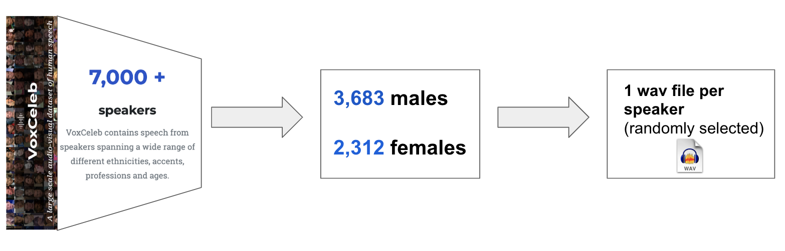

# Voice Gender Prediction

Whisper embeddings are used to train a model for voice gender prediction.

# The Dataset

The dataset was originally created by [jim-schwoebel](https://github.com/jim-schwoebel/voice_gender_detection).  All files are from VoxCeleb2. The files were separated into male and female, and a sample was randomly chosen per speaker.




The [original files](https://drive.google.com/file/d/1HRbWocxwClGy9Fj1MQeugpR4vOaL9ebO/view) are in m4a format. I did the conversion to wav format. You can download it from [this link](https://drive.google.com/file/d/1w2GYN_vrQ0NOMvxvRBCOmOPRAWAIwey9/view?usp=share_link).

# Getting Started


Install the requirements:

```sh
$ pip install -r requirements.txt
```

Extracting the whisper embeddings:

```sh
$ python extract_whisper_embeddings.py --input_dir=VoxCeleb_gender --output_dir=dataset --model_name=whisper-base
```

The available models are: 
    - whisper-tiny 
    - whisper-base 
    - whisper-small 
    - whisper-medium 
    - whisper-large


Training the model:


```sh
$ python train.py --config=config_whisper_tiny_dense_model.json
```

After training the model, or downloading the checkpoints from [this link](https://drive.google.com/file/d/1JLI3Gvywa8KnUamN27uvpj04BPjeX3VH/view?usp=share_link), you can run the inference script:


```sh
$ python test.py --config=config_whisper_tiny_dense_model.json --resume=./checkpoints/model_best.pth
```

# References:

- jim-schwoebel's Project  [sourcecode](https://github.com/jim-schwoebel/voice_gender_detection)
- jim-schwoebel's Dataset [download](https://drive.google.com/file/d/1HRbWocxwClGy9Fj1MQeugpR4vOaL9ebO/view)
- VoxCeleb [Official Page](www.robots.ox.ac.uk/~vgg/data/voxceleb/)